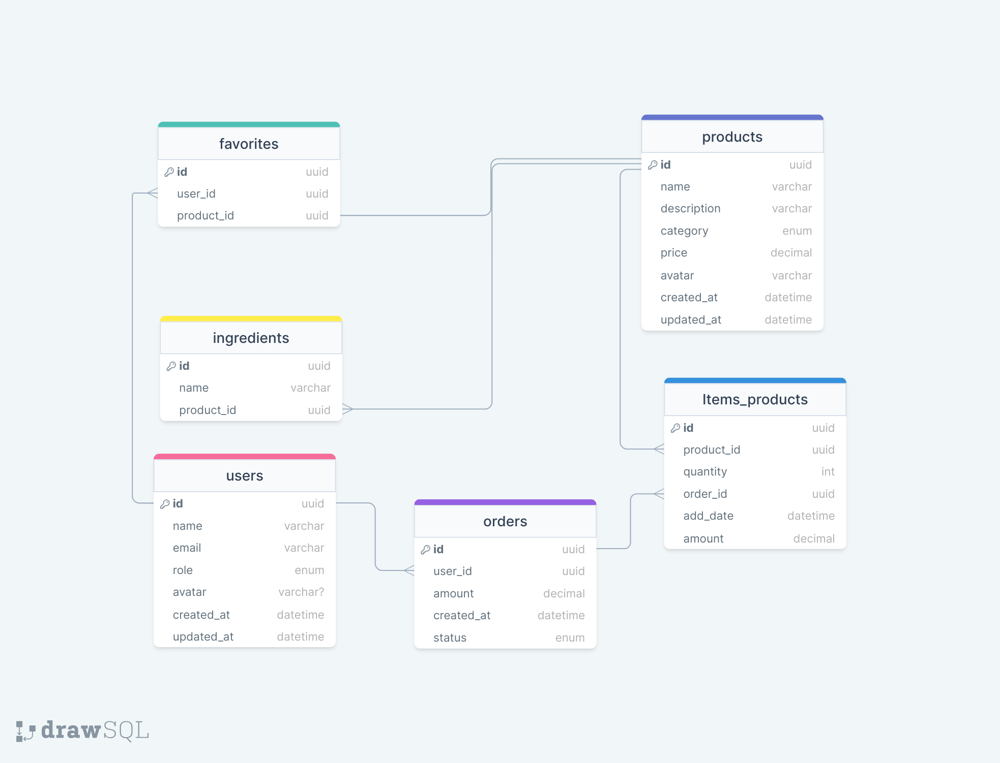

# Food Explorer

## Instruções de como rodar:

### Front end

url: https://foodexplorer-ily5.onrender.com (pode haver problemas durante uploads)

Dependências:

- Ter .env como no .env.example do frontend
- Ter node.js 20 ou superior instalado

- exemplo de configurações .env da pasta frontend (em um arquivo .env como em .env.example):
  - VITE_BACKEND_NODE_HOST=http://localhost:8080

Para rodar:

- rodar o backend previamente
- cd frontend (ir para a pasta frontend)
- npm install --legacy-peer-deps
- npm run dev

### Back end

url: https://fudexplorer.netlify.app/ (pode haver problemas durante uploads)

Dependências:

- Ter node.js 20 ou superior instalado
- Criar .env como no .env.example da pasta api (não precisa do DATABASE_URL_PROD para em desenvolvimento)
- Ter docker e docker compose instalado (Não obrigatório)
  - Caso não possua docker e docker compose, criar banco de dados postgres manualmente com as configurações do .env.example

Para rodar:

- rodar o banco de dados (docker compose up -d, ou no docker desktop, ou rodar banco manualmente)
- cd api (ir para pasta api)
- npm install
- npm run dev

obs:

- Para o banco de dados: no windows o docker e docker compose pode ser usado instalando ubuntu da microsoft store e integrando ao wsl 2 (precisa ser instalado) dentro do docker desktop
- Para o banco de dados: Também pode ser iniciado um banco postgres diretamente com as configurações

- exemplo de configurações .env na pasta api (em um arquivo .env como em .env.example):

  - SERVER_PORT=8080
  - AUTH_SECRET=dadadasdsdsadsadada3
  - REFRESH_SECRET=asdasdsadasds3
  - (deve ser o mesmo no banco Postgres criado manualmente) POSTGRES_PASSWORD=senha
  - (deve ser o mesmo no banco Postgres criado manualmente) POSTGRES_USER=root
  - (deve ser o mesmo no banco Postgres criado manualmente) POSTGRES_DB=foodexplorer-database
  - (deve ser o mesmo no banco Postgres criado manualmente) HOST=localhost
  - DATABASE_URL_PROD=XXXXX
  - NODE_ENV=development

## Meus requisitos levantados para o projeto (misturado com milha extra - ainda não implementado):

### Usuário não autenticado

- Registro de usuario - create | nao autenticado
- Login com autenticação - create | nao autenticado

### Usuário autenticado

- Logout
- Atualização de dados do usuario (Extra/Opcional) - update
- listar pratos por categoria - index
- mostrar prato - show
- pode buscar pratos por ingredientes ou pelo nome - index
- pode favoritar itens listados
- listar produtos favoritos - index favorite pode navegar até os produto

### Usuário comum

- poder adicionar e remover quantidade de pratos para incluir no pedido
- realizar inclusão da quantidade de itens pedidos - create item_product
- itens do pedido são armazenados em local storage durante navegação (Extra/opcional)
- inclusão de itens pedidos numa entidade carrinho após logout (Extra/opcional) - create item_product
- mostrar meu pedido com valor total, itens-produto com quantidade e valor final - (um tipo de show usando o localStorage por exemplo, o cart deve ser recarregado no localstorage, o cart só serve para o logout - ele é criado - create cart ou atualizado - update? cart, e para a finalização da compra - delete? cart)
- é possível excluir cada item pedido nessa tela - delete item_product
- nessa tela mostra as formas de pagamento e status do pedido - se pagamento aprovado - create o pedido é criado - create, o cart e localStorage devem ser deletados - delete? cart
- no final do procedimento mostra que o pedido foi entregue, tela deve ser redirecionada a outro local.
- listar histórico de pedidos - index pedidos e show pedido podendo rever tela de pedido - vendo mais detalhes e status do pedido

### Admin

- pode criar pratos para o restaurante - create prato
- ao ver um prato pode editá-lo ao invez de incluir em carrinho - update prato
- em vez de historico de pedidos pode ver pedidos - index de pedido
- para cada produto pode ver detalhes e atualizar o status do pedido existente - index e update de pedido
- o admin não pode favoritar mais e em vez de ver meus favoritos o admin pode ver os produtos mais favoritados "Favoritos" mostrando o nome de usuario e seu avatar (Minhas modificações - opcional) - index favoritos

#### Modelo ER

# Front e Back Food Explorer"

### Modificações escolhidas por mim -

### em vez de usar sqlite pegando o DB pelo aquivo database.db,

### escolhi usar o DB postgres em um container Docker,

### também escolhi usar typescript + jest

#### FIGMA: https://www.figma.com/file/vAq7WgKTPmFqzZ5YIROS9i/food-explorer-v2-(Community)?node-id=201%3A1532&mode=dev

#### modelo ER feito no DRAWSQL: https://drawsql.app/

#### REQUISITOS DO PROJETO: https://app.rocketseat.com.br/explorer/final-challenge

anotações pessoaos durante o projeto:

// Para rodar o knex ->
// npm install knex --save
// npx knex init - gera o novo knexfile
// npx knex migrate:make <nome da migration>

// pool: {
// afterCreate: (connection, callback) => connection.run("PRAGMA foreign_keys = ON", callback)
// },
// Habilita o uso do delete onCascade no sqlite

// para rodar - npx knex migrate:latest - isso sem criar um script no package.json

para usar o ES6 - type: module e capturar o ccaminho das pastas->
import path from 'path';
import { fileURLToPath } from 'url';

const **filename = fileURLToPath(import.meta.url)
const **dirname = path.dirname(\_\_filename)

na pasta database:
npx knex migrate:list - veja migrates nao upadas
npx knex migrate:down <nome> - para desmontar migrates
npx knex migrate:up - veja montar as migrates - agora atualizadas
npx knex migrate:latest - pode atualizar os desmontados
criar migração: npx knex migrate:make nomedamigração -x ts

inicialmente rodar o banco de dados Postgres com o container docker e instalar npm pg
criando o app next:
npm install -g create-next-app
npx create-next-app nome-do-seu-projeto

docker stop $(docker ps -aq) &&
docker rm $(docker ps -aq) &&
docker-compose down -v &&
docker volume prune -f &&
docker-compose up --build

npx knex migrate:latest --knexfile src/database/knexfile.ts
